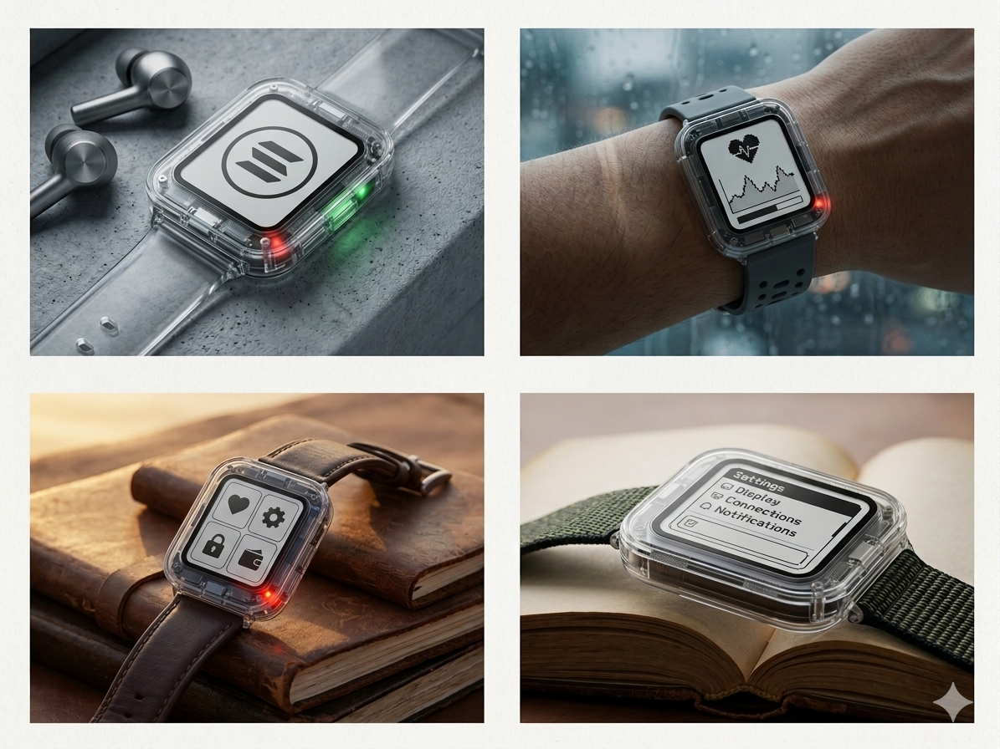
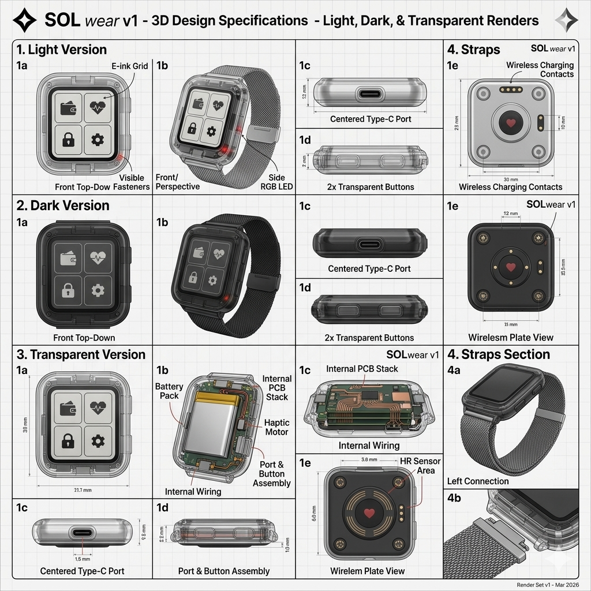
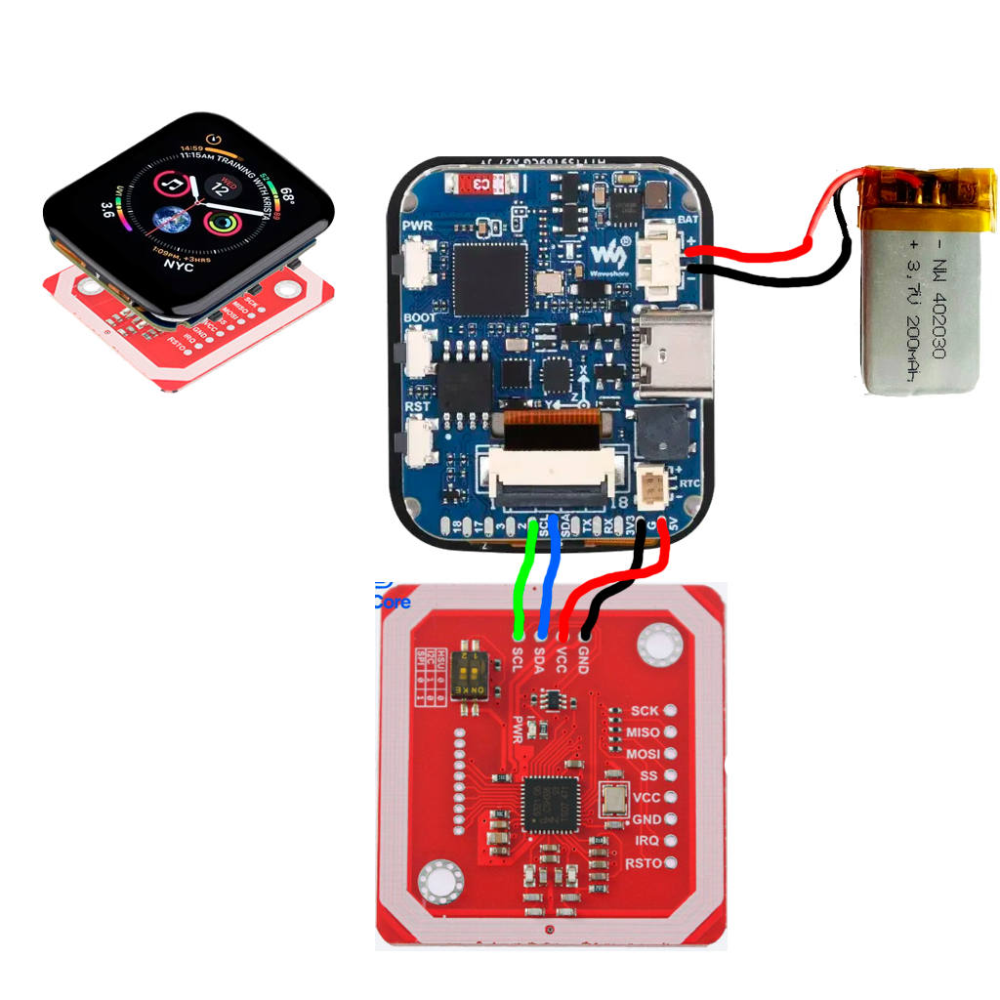
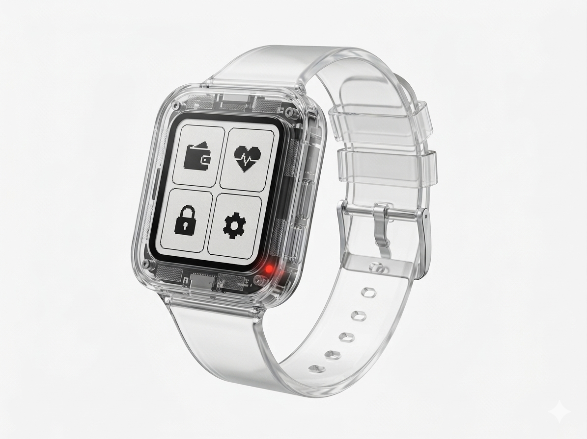

<p align="center">
  
</p>

<div align="center">

# SolWear

**A secure Solana hardware wallet with the comfort of NFC tap-to-pay.**

[](https://solana.com)


[Website](https://solwear.tech) | [X](https://x.com/SolWear_) | [Instagram](https://instagram.com/solwear.watch) | [TikTok](https://tiktok.com/@solwear)

</div>

SolWear is a wearable hardware wallet for Solana. It keeps wallet material on a dedicated device, gives the user an approval screen on the wrist, and lets an Android phone act as the fast NFC relay for everyday payments, wallet actions, and signing flows.

This public repository is the prototype bundle. It brings the firmware, Android companion, desktop service tool, website, and project profile into one place so the complete system can be reviewed from hardware to user experience.

## How It Works

1. The watch stores wallet material locally and shows signing approvals on its own display.
2. The Android companion prepares Solana transactions and opens an NFC session.
3. SolWear receives the request, the user confirms on the watch, and the device returns only the signed payload or signature.
4. The phone broadcasts through Solana RPC while the private key stays on the wearable.

## What Is Included

| Directory | Purpose | Stack |
| --- | --- | --- |
| `firmware/` | SolWearOS firmware for the watch prototype | ESP-IDF, C, ESP32-S3 |
| `mobile/` | Android companion for pairing, wallet preview, NFC signing, and transaction relay | Kotlin, Jetpack Compose |
| `service-tool/` | Desktop utility for serial inspection, flashing, and device service workflows | Python, Tkinter |
| `website/` | Product site and signup/preorder experience | Next.js, React, Tailwind |
| `profile/` | GitHub profile copy and project material | Markdown, media |

## Prototype Status

| Area | Current state |
| --- | --- |
| Hardware | ESP32-S3 Mini prototype with ST7789 display, PN532 NFC, four buttons, LiPo power, and 3D-printed enclosure |
| Firmware | SolWearOS Prototype V2 UI with reimagined Pebble-inspired monochrome visuals, detailed watchfaces, signing review, wallet, stats, battery, storage, and NFC interaction surfaces |
| Mobile | Android NFC reader/signing flow tuned for Prototype V2 tag-mode pairing, wallet preview, Solana RPC balance, and send path |
| Tooling | Desktop service utility for serial inspection, status dashboards, settings, and flashing |
| Security model | Private key stays on the wearable; phone handles public data, unsigned requests, signed payloads, and network submission |

## Latest Update

See [UPDATE_LOG.md](UPDATE_LOG.md) for the Prototype V2 SolWearOS visual refactor, GM/GN watchfaces, NFC signing updates, and mobile companion changes.

## Prototype Gallery

<p align="center">
  
  
  
</p>

## Prototype Hardware

| Component | Part |
| --- | --- |
| MCU | Lolin ESP32-S3 Mini |
| Display | ST7789 240 x 240 IPS over SPI |
| NFC | PN532 over I2C |
| Power | TP4056 charger with 350 mAh LiPo |
| Input | Four active-low tactile buttons |
| Storage | NVS for wallet material, SPIFFS for receipts and game state |

## Solana Integration

SolWear is Solana-first. The Android companion app connects to Solana RPC, reads the wearable wallet public key, displays SOL balance and price context, builds a native System Program transfer, sends the unsigned transaction to the wearable for offline Ed25519 signing, then submits the signed transaction back to Solana and polls confirmation status.

Relevant implementation and docs:

- `mobile/app/src/main/java/com/solwear/mobile/data/solana/SolanaRepository.kt` wraps Solana JSON-RPC calls for balances, blockhashes, transaction submission, and confirmation checks.
- `mobile/app/src/main/java/com/solwear/mobile/viewmodel/WalletViewModel.kt` validates addresses, builds transfer bytes, requests hardware signing over NFC, injects the signature, and broadcasts the transaction.
- `mobile/app/src/main/java/com/solwear/mobile/nfc/NfcSessionManager.kt` manages the phone-side NFC signing session.
- `mobile/docs/NFC_PROTOCOL_NDEF.md` documents the NFC signing protocol.
- `mobile/docs/SOLANA_TX_FLOW.md` documents the transaction lifecycle.

## Build SolWearOS

```bash
cd firmware
idf.py set-target esp32s3
idf.py build
idf.py -p COM_PORT flash monitor
```

Replace `COM_PORT` with your board serial port.

## Run The Mobile App

Open `mobile/` in Android Studio and let Gradle sync, or build from the command line:

```bash
cd mobile
./gradlew assembleDebug
```

Use an NFC-capable Android phone for the watch pairing and signing demo.

## Run The Service Tool

```bash
cd service-tool
pip install -r requirements.txt
python main.py
```

## Run The Website

```bash
cd website
npm install
npm run dev
```

The website can also be run with Docker:

```bash
cd website
docker-compose up --build
```

## Links

- Website: https://solwear.tech
- X: https://x.com/SolWear_
- Instagram: https://instagram.com/solwear.watch
- TikTok: https://tiktok.com/@solwear
