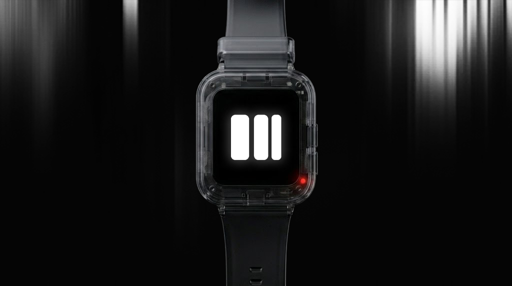

<div align="center">



# SolWear

### *Your Solana wallet on your wrist.*

**A portable, light, hardware wallet for crypto — built into a smartwatch.**

[](https://solana.com)
[]()
[]()
[]()

[**Firmware →**](https://github.com/SolWear/solwear_os) &nbsp;·&nbsp; [**Service Tool →**](https://github.com/SolWear/solwear_service_tool) &nbsp;·&nbsp; [**Org →**](https://github.com/SolWear)

</div>

---

## The pitch

> Hardware wallets today are clunky, single-purpose USB sticks you forget in a drawer. **SolWear** is a wallet you actually wear — a smartwatch that signs Solana transactions, taps NFC payment tags, counts your steps, and runs a full app launcher. One device. Always with you. Cold-storage when you want it, tap-to-pay when you don't.

Built on a **Waveshare RP2040-Touch-LCD-1.69** with a 240×280 IPS touchscreen, IMU, NFC reader, 1200 mAh battery, and a buzzer — running our own from-scratch operating system, **SolWearOS**.

## Why SolWear

| Traditional hardware wallet | SolWear |
|---|---|
| Lives in a drawer | Lives on your wrist |
| Plug into a computer to use | Tap a phone, tap an NFC terminal |
| One purpose | Smartwatch + wallet + fitness + NFC |
| You forget about it | You wear it 24/7 |
| ~$80–$300 just for signing | One device replaces three |

## What's inside this organization

| Repo | What it is |
|---|---|
| **[solwear](https://github.com/SolWear/solwear)** *(you are here)* | Hackathon showcase, prototype assets, project landing page |
| **[solwear_os](https://github.com/SolWear/solwear_os)** | The smartwatch firmware — HAL, kernel, UI, all eight apps |
| **[solwear_service_tool](https://github.com/SolWear/solwear_service_tool)** | Desktop debugger, live serial console, one-click UF2 flasher |

Three repositories. One platform. Built and maintained inside the SolWear org.

## The hardware

<table>
<tr>
<td width="60%">

| Component | Spec |
|---|---|
| **MCU** | RP2040 · 264 KB SRAM · 16 MB flash |
| **Display** | ST7789V2 · 1.69" · 240×280 IPS touch |
| **Touch** | CST816S capacitive |
| **IMU** | QMI8658 6-axis (steps, gestures, wake-on-wrist) |
| **NFC** | PN532 v3 — *off by default for power & security* |
| **Battery** | 1200 mAh LiPo · USB-C charging |
| **Audio** | Passive piezo (clicks, alarms, transaction confirms) |

</td>
<td width="40%" align="center">

<br/>
<sub><i>Working prototype</i></sub>

</td>
</tr>
</table>

## SolWearOS at a glance

- **Square-icon app launcher** — Wallet · NFC · Settings · Health · Stats · Game · Alarm · Charging
- **Solana wallet** — address storage, NFC `solana:` URI tag write/read, contract test stub
- **NFC stays off** until the wallet or NFC app actually needs it (security + battery)
- **Animated charging screen** that auto-pushes when USB is plugged in
- **Live `[STATUS]` heartbeat** over USB CDC for the desktop service tool
- **Three watch faces** — digital, analog, minimal
- **Procedural icons & wallpapers** drawn at runtime — near-zero flash cost
- **Strip-mode display fallback** — the device boots even if 131 KB sprite alloc fails
- **LittleFS** for persistent settings, wallet, and weekly step history
- **Single-core 30 fps** event loop with a lock-free ring buffer event system

> Footprint: **12 KB RAM · 196 KB flash** — the entire OS uses 4.7% RAM and 1.4% flash. Plenty of headroom for crypto libs, BLE, and OTA updates.

## How it all fits together

```
   ┌─────────────────────────┐         ┌──────────────────────────┐
   │       SolWearOS         │   USB   │   SolWear Service Tool   │
   │   (RP2040 firmware)     │◄───────►│    (desktop debugger)    │
   │                         │   CDC   │                          │
   │  apps  →  ui  →  core   │         │   console · status       │
   │           ↓             │         │   settings · firmware    │
   │          hal            │         │                          │
   └────────────┬────────────┘         └──────────────────────────┘
                │
   ┌────────────▼────────────┐
   │     RP2040 hardware     │
   │  Display · Touch · IMU  │
   │   NFC · Battery · BZR   │
   └─────────────────────────┘
```

## Try it yourself

**Build & flash the firmware**
```bash
git clone https://github.com/SolWear/solwear_os.git
cd solwear_os
pio run
# Hold BOOTSEL on the watch, plug in USB, drag the .uf2 onto RPI-RP2:
#   .pio/build/solwearos/firmware.uf2
```

**Run the desktop service tool**
```bash
git clone https://github.com/SolWear/solwear_service_tool.git
cd solwear_service_tool
run.bat            # quick dev launch
# or:
build.bat          # bundle a single SolWearServiceTool.exe
```

The service tool gives you live serial logs, a battery dashboard, a settings editor, and one-click UF2 flashing — everything you need to develop on the watch.

## Roadmap

### Now (Hackathon demo)
- Custom OS with eight working apps
- Touch UI · IMU · battery · charging · NFC · buzzer
- Solana wallet stub with NFC tag write/read
- Desktop service tool with live debugger and flasher
- Animated charging screen, live battery & system stats

### Next
- BLE companion app (Android / iOS)
- Real Solana transaction signing (Ed25519 on-device)
- BIP-39 seed phrase setup wizard
- OTA firmware updates over BLE
- Tap-to-pay flow with merchant NFC tags
- Heart rate sensor integration

## The team

Built by SolWear for the **Frontier Hackathon**.
Hardware · firmware · desktop tools · branding — all in-house.

## Contact & links

- **Organization:** https://github.com/SolWear
- **Firmware:** https://github.com/SolWear/solwear_os
- **Service tool:** https://github.com/SolWear/solwear_service_tool

---

<div align="center">

**SolWear**

*Portable. Light. Always with you. The Solana wallet you actually wear.*

<sub>© SolWear · All rights reserved</sub>

</div>
