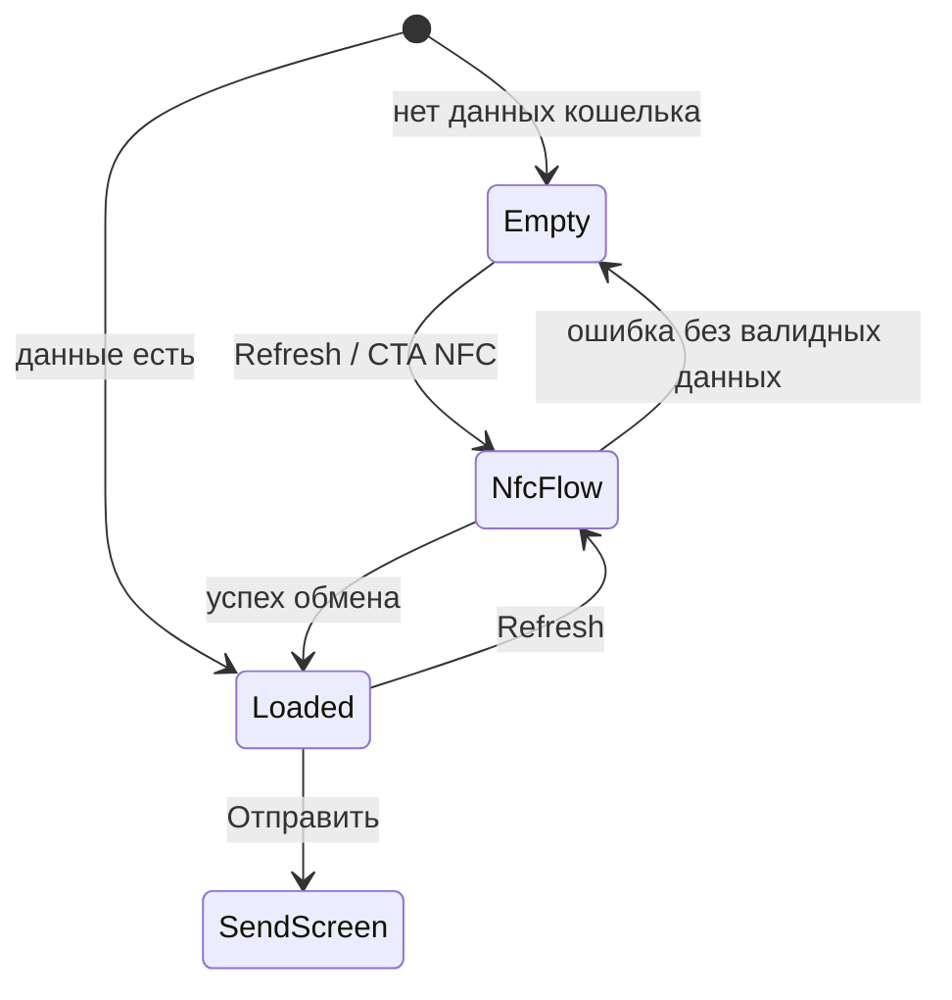
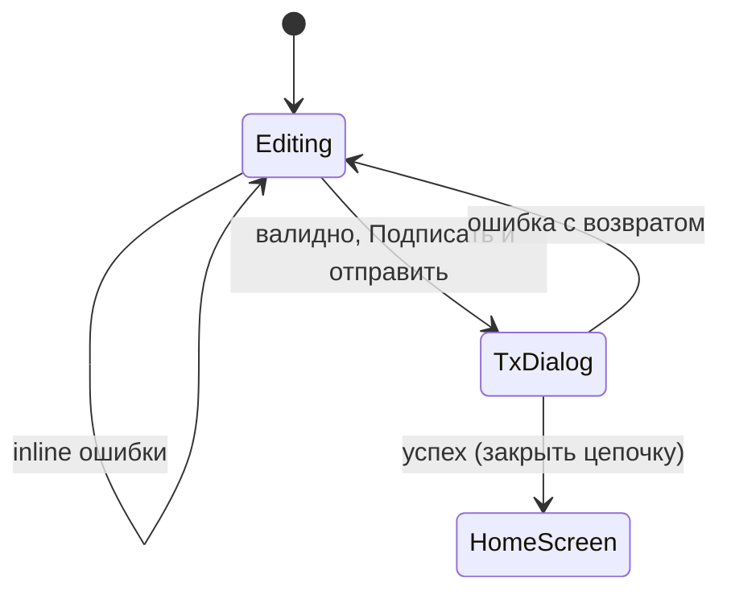
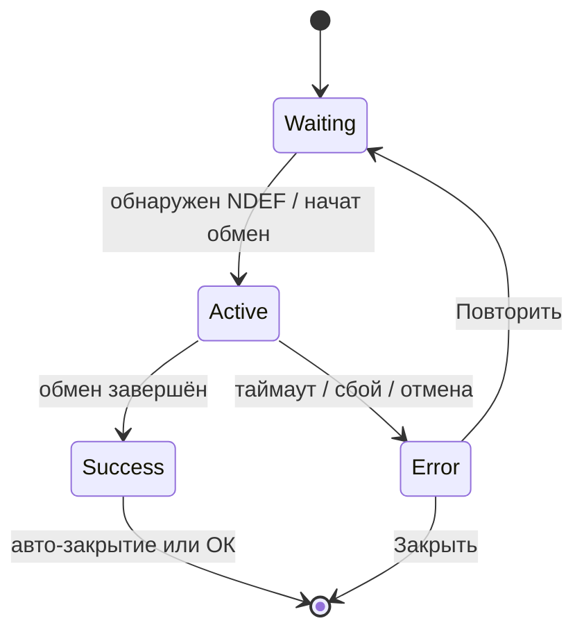
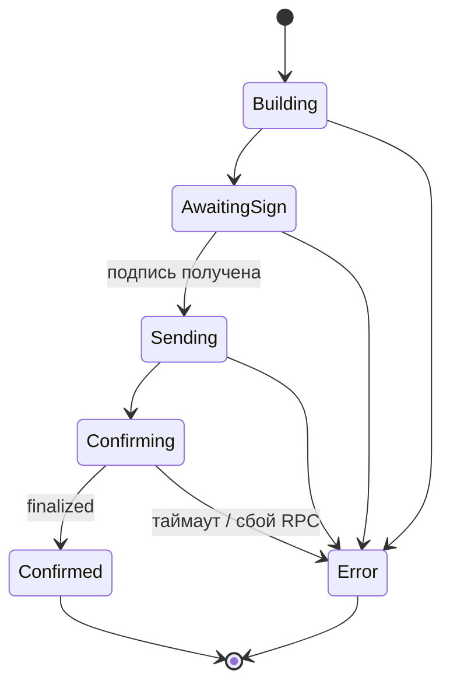

# UI/UX Specification: Solvare (Android)

**Версия:** 1.0  
**Связанный документ:** `docs/PRD.md`  
**Платформа:** Android (Material 3 / Compose — по решению команды)

---

## 1. Принципы UX

- Минимум отвлечений: один основной показатель (баланс SOL) на главном экране.
- Все длительные операции (NFC, RPC) сопровождаются **явным состоянием** и возможностью отмены/закрытия там, где это безопасно.
- Ошибки — **конкретные**, без технического жаргона; повтор действия — там, где имеет смысл (NFC, отправка).

---

## 2. Темы оформления

### 2.1 Тёмная тема (основная, Solana-бренд)

| Токен | Значение | Применение |
|-------|----------|------------|
| Primary accent (зелёный Solana) | `#14F195` | Ключевые CTA, акцентные иконки, успешные состояния |
| Secondary accent (фиолетовый) | `#9945FF` | Вторичные акценты, градиенты, выделение карточек |
| Фон основной | Тёмно-серый / почти чёрный (`#0D0D12` — ориентир) | Scaffold, фон экранов |
| Поверхность / карточки | Приподнятый тёмный (`#1A1A24` — ориентир) | Контейнеры, bottom sheet |
| Текст основной | `#F5F5F7` | Заголовки, основной контент |
| Текст вторичный | `#A0A0B0` | Подписи, USD, подсказки |
| Ошибка | `#FF6B6B` (ориентир) | Сообщения об ошибках, деструктивные акценты |
| Разделители | Низкая контрастность на тёмном фоне | Списки, секции |

**Рекомендация:** допустим лёгкий **градиент** или мягкое свечение акцентов (зелёный → фиолетовый) на фоне хедера главного экрана — без ухудшения читаемости.

### 2.2 Светлая тема

- Поддержка **светлой темы** обязательна (системная тема или переключатель в настройках — на усмотрение реализации).
- Сохранить узнаваемость бренда: акценты те же (`#14F195`, `#9945FF`), фон светлый нейтральный, текст тёмный, вторичный текст — серый.
- Контраст текста и интерактивных элементов — **WCAG AA** по возможности.

---

## 3. Типографика (иерархия)

| Уровень | Назначение | Параметры (ориентир) |
|---------|------------|----------------------|
| **H1** | Баланс SOL на главном | Крупный размер (например 40–48 sp), полужирный, основной цвет текста |
| **H2** | Заголовки экранов («Отправить») | 22–28 sp, semibold |
| **Body** | Поля ввода, основной текст | 16 sp, regular |
| **Caption** | USD-эквивалент, подсказки под полями | 13–14 sp, secondary color |
| **Label** | Кнопки, чипы состояний | 14–16 sp, medium |

Числа баланса: **табличные цифры** (если доступно в шрифте) для стабильной ширины строки.

---

## 4. Паттерны обработки ошибок (UX)

1. **Inline-валидация** на экране отправки: сообщение под полем, красная обводка при фокусе/после submit.
2. **NFC / сеть:** сообщение внутри `NfcBottomSheet` или `TransactionStatusDialog` с кнопками «Повторить» / «Закрыть».
3. **Неблокирующие сбои курса:** деградация до «Курс недоступен», без блокировки баланса SOL.
4. **Критические сбои (нет NFC):** полноэкранное или стартовое объяснение с иллюстрацией; не предлагать фичи NFC как активные.
5. Не показывать сырые stack trace; опционально «Подробности» сворачиваемым блоком для отладки (debug build).

---

## 5. Экраны

### 5.1 HomeScreen (Главный)

**Назначение:** отображение баланса и вход в отправку / обновление.

**Состав:**

- **Верхняя панель:** опциональный заголовок или логотип; справа **иконка обновления** (refresh).
- **Центр:**
  - **Крупно:** `XX.XXXX SOL` (формат согласовать с точностью RPC; отображение — human-readable).
  - **Мелко, серым:** `≈ $XX.XX` или `~$XX.XX` (курс из CoinGecko).
- **Низ:** первичная кнопка **«Отправить»** (полная ширина с отступами).

**Empty state (кошелёк не подключён / нет данных с часов):**

- Иллюстрация или иконка NFC/часов.
- Заголовок: например, «Подключите кошелёк».
- Текст: кратко объяснить необходимость NFC с часами.
- CTA: **«Обновить через NFC»** или то же действие, что и refresh — ведёт к `NfcBottomSheet`.

**Состояния:**

| Состояние | Поведение UI |
|-----------|----------------|
| Загрузка начальных данных | Skeleton или индикатор на месте баланса |
| Данные есть | Баланс + USD |
| Курс недоступен | SOL отображается; USD — placeholder |
| Ошибка загрузки баланса (RPC) | Баннер или inline с «Повторить» |

---

### 5.2 SendScreen (Отправка)

**Назначение:** ввод получателя и суммы, запуск подписи и отправки.

**Состав:**

- **Навигация назад** (стрелка / top bar).
- Поле **адрес получателя** (однострочное, моноширинный шрифт опционально).
- Поле **сумма SOL** (числовой ввод, десятичный разделитель по локали).
- Кнопка **«Подписать и отправить»** (primary, внизу).

**Валидация (inline):**

- Пустой / некорректный адрес Solana.
- Пустая / нечисловая / отрицательная сумма.
- Сумма **больше доступного** баланса (с учётом комиссии — если комиссия учитывается, показать подсказку).

После успешной валидации по нажатию кнопки открывается цепочка: сначала может показываться `TransactionStatusDialog`, для этапа подписи — сочетание с `NfcBottomSheet` (см. переходы ниже).

---

### 5.3 NfcBottomSheet (нижняя модалка NFC)

**Триггеры:** обновление с главного экрана; этап подписи при отправке (если выделен в отдельный sheet).

**Состояния:**

| Состояние | Визуал | Текст (пример) |
|-----------|--------|----------------|
| **Ожидание** | Пульсирующая иконка NFC | «Поднесите часы к телефону» |
| **Чтение / запись** | Спиннер (indeterminate) | «Обмен данными…» / «Не убирайте устройство» |
| **Успех** | Галочка (checkmark), акцентный цвет | «Готово» |
| **Ошибка** | Иконка ошибки | Краткое сообщение + кнопки **«Повторить»** и **«Закрыть»** |

**Поведение:**

- Swipe-down или кнопка закрытия — разрешены в состояниях **ожидание** и **ошибка**; в **чтение/запись** — заблокировать случайное закрытие или показать подтверждение.
- После **успеха** — авто-закрытие через короткую задержку (например 0.8–1.2 с) или явная кнопка «ОК».

---

### 5.4 TransactionStatusDialog (статус транзакции)

**Назначение:** сквозной прогресс отправки SOL после инициации с SendScreen.

**Состояния:**

| Состояние | Визуал | Описание для пользователя |
|-----------|--------|---------------------------|
| **Building** | Индикатор прогресса | «Формируем транзакцию» |
| **Awaiting sign** | Связка с NFC: можно показать мини-подсказку «Подпишите на часах» + открытие `NfcBottomSheet` | «Ожидаем подпись» |
| **Sending** | Спиннер | «Отправляем в сеть» |
| **Confirming** | Спиннер или линейный прогресс неопределённый | «Подтверждаем в блокчейне» |
| **Confirmed** | Успех + возможность копировать signature | Показать **signature** (сокращённо + копирование) |
| **Error** | Иконка ошибки | Сообщение об ошибке + **«Закрыть»**; **«Повторить»** — если уместно (например сеть) |

**Примечание:** диалог не должен «терять» контекст при смене состояния; заголовок может оставаться «Отправка SOL».

---

## 6. Диаграммы переходов состояний

### 6.1 HomeScreen

`NfcFlow` — показ `NfcBottomSheet` с под-состояниями waiting → reading/writing → success | error.

### 6.2 SendScreen

### 6.3 NfcBottomSheet (внутренние состояния)

### 6.4 TransactionStatusDialog

**Связка AwaitingSign + NFC:** при входе в `AwaitingSign` открывается `NfcBottomSheet`; после `Success` в sheet — переход к `Sending`.

---

## 7. Доступность и устройства

- Минимальная высота касания 48 dp для кнопок и иконок в зонах действий.
- Поддержка **TalkBack:** contentDescription для refresh, NFC-иконок, кнопок диалогов.
- Учёт **жестовой навигации** и вырезов экрана (padding для bottom sheet и кнопок).

---

## 8. Согласование с PRD

- Только **SOL**, без списка токенов и истории.
- **Devnet** — рекомендуется визуальный индикатор (баннер или бейдж) в шапке, если команда принимает решение из открытых вопросов PRD.

---

## 9. Чеклист реализации UI

- [ ] Тёмная тема с акцентами `#14F195` / `#9945FF`
- [ ] Светлая тема с теми же акцентами
- [ ] HomeScreen: баланс + USD + refresh + Отправить + empty state
- [ ] SendScreen: поля, inline-ошибки, back, основная кнопка
- [ ] NfcBottomSheet: waiting / active / success / error
- [ ] TransactionStatusDialog: полная цепочка до confirmed / error
